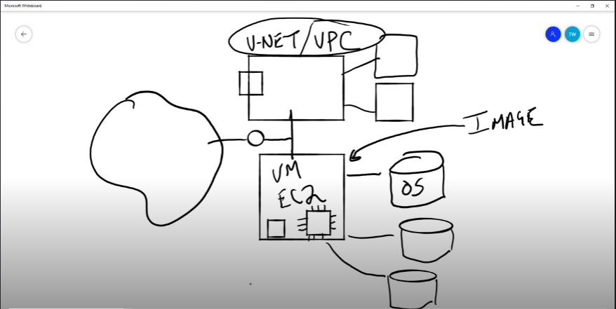

# ICCA Exam Notes

## 1. Cloud Basics

### What is the cloud:
---
It will cover the following few things.
- Cloud Architecture.
- Types of clouds services.
- Accessing cloud services.
---

- In IT, "on premises" (often abbreviated as "on-prem" or "on-premises") refers to software, hardware, and infrastructure that are located within the physical confines of an organization's property.
- But now a days there mostly things are dependent on virtualization and virtual infrastructure. So, rather than wires and computers and all that you would have virtual machines and all that in your base line. 
- Following is the bottom to top representation of on-prem stuff.

| Work Load                    | **WORK LOAD IS BASICALLY WORK LOAD**            |
| ---------------------------- | ----------------------------------------------- |
| **Services**                 | **Mongo DB, MySql**                             |
| **Virtual Machines**         | **Linux Distros, Windows**                      |
| **Virtualization Softwares** | **Platform, Maintenance, Updates, Platform**    |
| **Physical Infrastructure**  | **Power, Networks, Racks, Storage**             |
| **Physical Building**        | **Cost of Space, Physical Security, Personals** |
- There is a famous saying that ***There is no cloud, You are using someone else's computer***
- Cloud takes care of the bottom three sections i.e. **Virtualization Softwares**, **Physical Infrastructure**, **Physical Building**.
- Regarding architecture, On-Prem and Cloud are structured and operate exactly the same.

| Work Load                    | **WORK LOAD IS BASICALLY WORK LOAD**                          |
| ---------------------------- | ------------------------------------------------------------- |
| **Services**                 | **Mongo DB, MySql**                                           |
| **Virtual Machines**         | **Linux Distros, Windows**                                    |
| **Manegment Plan**           | **Cloud computing context outlines strategies and practices** |
| **Virtualization Softwares** | **Platform, Maintenance, Updates, Platform**                  |
| **Physical Infrastructure**  | **Power, Networks, Racks, Storage**                           |
| **Physical Building**        | **Cost of Space, Physical Security, Personals**               |

***Data Management Plan (DMP)***
- **Focus**: Primarily on the handling of data throughout its lifecycle.
- **Scope**: Covers data creation, storage, sharing, protection, and eventual archiving or deletion.
***General Management Plan***
- **Focus**: Comprehensive management of all cloud resources and services.
- **Scope**: Encompasses overall cloud infrastructure, including compute, storage, network, applications, and services.
---

- There is a term used in ***Lift and Shift***.
- Suppose if I have this workload on premises on a virtual machine and I just wanna take the vm and put it on the cloud so what I ma doing here is using the cloud for its infrastructure. So it would be know as the ***Infrastructure as service***.
- If I am hosting a web application or a database on cloud then it be an example of ***Platform as a service***.
- Management of the entire workload is known as the ***Software as service***. (Microsoft 365)
- The dividing lines between these ***as a services*** are blurry means that they support levels of customization.
- As we go up from IaaS to SaaS the ease of administration increases and as be go higher we reduce the amount of control that we have. 
- If I want to access my cloud services than we can use public endpoints that can be accessed from within the premise and outside as well.
- On the other hand if we want to make it a bit secure than we can use a VPN Tunnel or we can use a private circuit communication with the help of my cloud service provider that will be over a fiber optic cable. It would be costly but it would give me more throughput.
- Think of cloud as a **WAN**.

![[Pasted image 20240621215932.png]]

---
### Who are the Cloud Providers?
---
It will cover the following few things.
- Cloud Market
- AWS
- Azure
- Google Cloud Platform GCP
- Other Cloud Providers
---

- Amazon Web Serves also known as the AWS is the first biggest cloud services provider out there right now. Since 2006 and has Over 175 products and services.
- There is Azure since 2010 and approximately 170 services.
- Google cloud is from 2010 and has only 90 services and products. 

1. **Which of the following is closest to the projected size of the cloud market in 2025**
	- ***$1 trillion***
---

### Why Choose the Cloud?
---
It will cover the following few things.
- Cloud Economics
- CapEx. vs OpEx.
- Consumption-Based Spending
- Functional Advantages
- Also, Maybe Not
---

- Cloud is not the absolute solution for everything.
- Cloud economics mainly revolves around three major categories i.e. ***Storage***, ***Compute***, and ***Networking***. But compute and storage behave the same so they can be categorized as one major category by the name ***Compute***.
- Running out of storage in your on prem storage center is normal so mostly people use cloud for storage purposes.
- Sometimes we have a high compute demand on prem and suppose we pay extra Gs for it and when we don't need the compute anymore our hardware goes waste. But when it is on cloud we can add thousands of machines easily.

![[Pasted image 20240621231704.png]]

- There are two types of spending one is based on ***capacity*** (on-prem) and the other one is based on ***consumption***.

1. **Which of the following statements are true? Choose two.**
	- ***Using cloud compute requires no upfront capital costs***
	- ***Cloud storage is in most cases effectively unlimited***
2. Which of the following is a reason to not choose the cloud?
	- ***Existing data center investment***
---
---

### 2. Cloud Management

### Managing Cloud Resources
---
It will cover the following few things.
- Cloud Management Tools
- Web-Based Cloud Management
- Command Line Cloud Management
- Cloud API
---

- There are three major management tools for clouds i.e. ***Web Based***, ***CLI Based***, and ***Rest API***.
- The ***Rest API*** helps to control the whole Cloud with the help of only APIs (Application Programable Interface).
- All the three Major Cloud service providers have a web based interface Azure call it a ***Portal*** and on the other hand Google and AWS call it ***Console***.
- ***Cloud Shell*** is a CLI that can be used to mange stuff in the Cloud.
- In AWS shell `aws ec2 describe-instances` command gives information about the active instances.
- Whereas in GCP shell `gcloud compute instances list` command is used to perform the same function mentioned above.
- In Azure shell `az vm list` command is used to display the instances on the terminal.

1. ***Most CLI interfaces are downloadable, but will also have a __________ available for users, as well.***
	- ***Cloud Shell***

---

### Cloud Cost Management
---
It will cover the following few things.
- Cloud Pricing Models
- Cloud Billing
- Cost Monitoring
- Cost Optimizations
---

| Capacity Pricing Model                                      | Consumption Pricing Model                                                     |
| ----------------------------------------------------------- | ----------------------------------------------------------------------------- |
| Virtual Machines, Data Base (payment by hours/ min/ sec) | Storage, Serverless computing Payment on the bases of consuption and usage |
| Easy Budgeting                                              | Harder Budgeting                                                              |

- Some Cloud service providers utilize 3rd party vendor support and this can lead to additional costs. This is an example of Marketplace Billing.
- Your providers are going to have agents that are running and are watching your patterns and suggesting to you ways that you can use to optimize your cast.
- Azure calls it ***advisors***, AWS call these ***Cost Anomaly Detection***, and GCP calls it ***Recommenders***.
- Sizing is very important you have to find the right size for your resource for cost optimization.

---

### Cloud Support & SLAs
---
It will cover the following few things.
- Cloud Resource Responsibility
- Cloud SLAs
- Cloud Support
---

![[Pasted image 20240624221535.png]]

- Management Plan is the line blow which things work under the vender where as the above few things are under the user. So, if something happens in the respective area of the vender or the user then they are responsible for it.
- SLA (***Service Level Agreement***)

---
---

## 3. Cloud Services

### Cloud Infrastructure Services
---
It will cover the following few things.
- Infrastructure as a service
- Cloud Networking
- Cloud Compute
- Cloud Storage
---

- Infrastructure as a service is the lowest level of service provided by the Cloud Providers.
- They will be going to provide you all the services below the management plan.
- V-NET -- Virtual Network, VPC -- Virtual Private Cloud
- Boxes over lapping the main box lines are gateways

- NSG -- Network Security Group, ACL -- Access control list
- Big Box is the network, small boxes are the subnets.
- Gateway can be VPN Gateway, private circuit gateway
- LB -- Load Balancer
- FW -- Firewall 
- Following image is the example of Cloud Networking

![[Pasted image 20240625213518.png]]

![[Pasted image 20240625225055.png]]

- For storage AWS has ***S3 Buckets***, ***EFS***, and ***EBS***.
- Azure has ***Storage Account*** and ***Management Disks***.
- GCP has ***Storage Bucket*** and ***Compute Engine Disks and Images***.
- ***EBS -- Elastic Block Storage*** is used for storing the disk for a EC2.
