

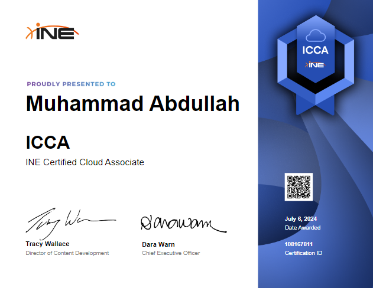

## 1. Cloud Basics

### What is the cloud:
---
It will cover the following few things.
- Cloud Architecture.
- Types of clouds services.
- Accessing cloud services.
---

- In IT, "on premises" (often abbreviated as "on-prem" or "on-premises") refers to software, hardware, and infrastructure that are located within the physical confines of an organization's property.
- But now a days there mostly things are dependent on virtualization and virtual infrastructure. So, rather than wires and computers and all that you would have virtual machines and all that in your base line. 
- Following is the bottom to top representation of on-prem stuff.

| Work Load                    | **WORK LOAD IS BASICALLY WORK LOAD**            |
| ---------------------------- | ----------------------------------------------- |
| **Services**                 | **Mongo DB, MySql**                             |
| **Virtual Machines**         | **Linux Distros, Windows**                      |
| **Virtualization Softwares** | **Platform, Maintenance, Updates, Platform**    |
| **Physical Infrastructure**  | **Power, Networks, Racks, Storage**             |
| **Physical Building**        | **Cost of Space, Physical Security, Personals** |
- There is a famous saying that ***There is no cloud, You are using someone else's computer***
- Cloud takes care of the bottom three sections i.e. **Virtualization Softwares**, **Physical Infrastructure**, **Physical Building**.
- Regarding architecture, On-Prem and Cloud are structured and operate exactly the same.

| Work Load                    | **WORK LOAD IS BASICALLY WORK LOAD**                          |
| ---------------------------- | ------------------------------------------------------------- |
| **Services**                 | **Mongo DB, MySql**                                           |
| **Virtual Machines**         | **Linux Distros, Windows**                                    |
| **Manegment Plan**           | **Cloud computing context outlines strategies and practices** |
| **Virtualization Softwares** | **Platform, Maintenance, Updates, Platform**                  |
| **Physical Infrastructure**  | **Power, Networks, Racks, Storage**                           |
| **Physical Building**        | **Cost of Space, Physical Security, Personals**               |

***Data Management Plan (DMP)***
- **Focus**: Primarily on the handling of data throughout its lifecycle.
- **Scope**: Covers data creation, storage, sharing, protection, and eventual archiving or deletion.
***General Management Plan***
- **Focus**: Comprehensive management of all cloud resources and services.
- **Scope**: Encompasses overall cloud infrastructure, including compute, storage, network, applications, and services.
---

- There is a term used in ***Lift and Shift***.
- Suppose if I have this workload on premises on a virtual machine and I just wanna take the vm and put it on the cloud so what I ma doing here is using the cloud for its infrastructure. So it would be know as the ***Infrastructure as service***.
- If I am hosting a web application or a database on cloud then it be an example of ***Platform as a service***.
- Management of the entire workload is known as the ***Software as service***. (Microsoft 365)
- The dividing lines between these ***as a services*** are blurry means that they support levels of customization.
- As we go up from IaaS to SaaS the ease of administration increases and as be go higher we reduce the amount of control that we have. 
- If I want to access my cloud services than we can use public endpoints that can be accessed from within the premise and outside as well.
- On the other hand if we want to make it a bit secure than we can use a VPN Tunnel or we can use a private circuit communication with the help of my cloud service provider that will be over a fiber optic cable. It would be costly but it would give me more throughput.
- Think of cloud as a **WAN**.

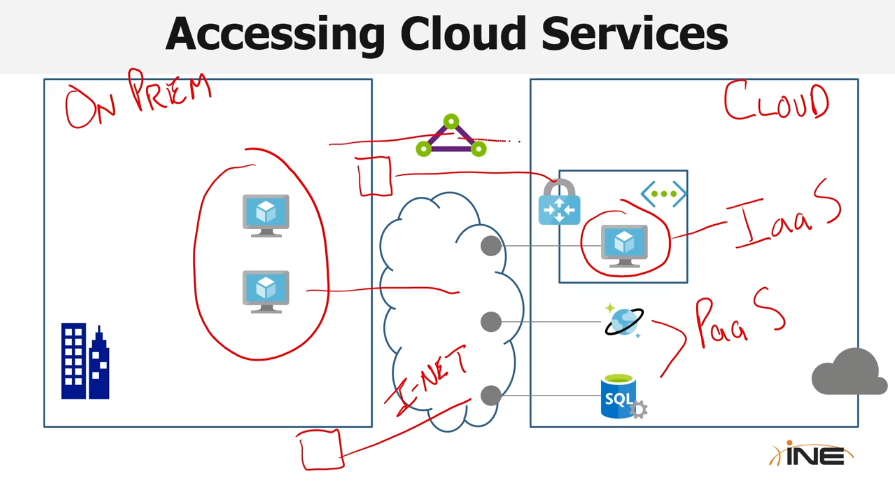

---
### Who are the Cloud Providers?
---
It will cover the following few things.
- Cloud Market
- AWS
- Azure
- Google Cloud Platform GCP
- Other Cloud Providers
---

- Amazon Web Serves also known as the AWS is the first biggest cloud services provider out there right now. Since 2006 and has Over 175 products and services.
- There is Azure since 2010 and approximately 170 services.
- Google cloud is from 2010 and has only 90 services and products. 

1. **Which of the following is closest to the projected size of the cloud market in 2025**
	- ***$1 trillion***
---

### Why Choose the Cloud?
---
It will cover the following few things.
- Cloud Economics
- CapEx. vs OpEx.
- Consumption-Based Spending
- Functional Advantages
- Also, Maybe Not
---

- Cloud is not the absolute solution for everything.
- Cloud economics mainly revolves around three major categories i.e. ***Storage***, ***Compute***, and ***Networking***. But compute and storage behave the same so they can be categorized as one major category by the name ***Compute***.
- Running out of storage in your on prem storage center is normal so mostly people use cloud for storage purposes.
- Sometimes we have a high compute demand on prem and suppose we pay extra Gs for it and when we don't need the compute anymore our hardware goes waste. But when it is on cloud we can add thousands of machines easily.

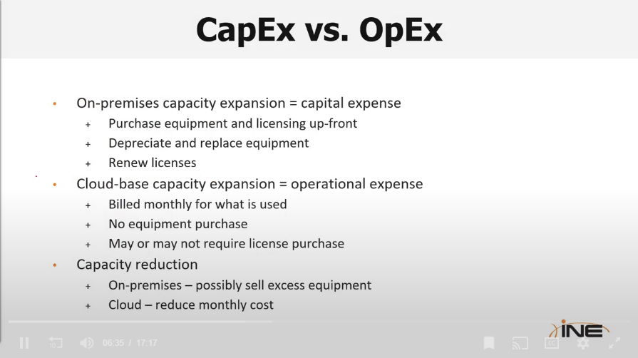

- There are two types of spending one is based on ***capacity*** (on-prem) and the other one is based on ***consumption***.

1. **Which of the following statements are true? Choose two.**
	- ***Using cloud compute requires no upfront capital costs***
	- ***Cloud storage is in most cases effectively unlimited***
2. Which of the following is a reason to not choose the cloud?
	- ***Existing data center investment***
---
---

### Cloud Management

### Managing Cloud Resources
---
It will cover the following few things.
- Cloud Management Tools
- Web-Based Cloud Management
- Command Line Cloud Management
- Cloud API
---

- There are three major management tools for clouds i.e. ***Web Based***, ***CLI Based***, and ***Rest API***.
- The ***Rest API*** helps to control the whole Cloud with the help of only APIs (Application Programable Interface).
- All the three Major Cloud service providers have a web based interface Azure call it a ***Portal*** and on the other hand Google and AWS call it ***Console***.
- ***Cloud Shell*** is a CLI that can be used to mange stuff in the Cloud.
- In AWS shell `aws ec2 describe-instances` command gives information about the active instances.
- Whereas in GCP shell `gcloud compute instances list` command is used to perform the same function mentioned above.
- In Azure shell `az vm list` command is used to display the instances on the terminal.

1. ***Most CLI interfaces are downloadable, but will also have a __________ available for users, as well.***
	- ***Cloud Shell***

---

### Cloud Cost Management
---
It will cover the following few things.
- Cloud Pricing Models
- Cloud Billing
- Cost Monitoring
- Cost Optimizations
---

| Capacity Pricing Model                                      | Consumption Pricing Model                                                     |
| ----------------------------------------------------------- | ----------------------------------------------------------------------------- |
| Virtual Machines, Data Base (payment by hours/ min/ sec) | Storage, Serverless computing Payment on the bases of consuption and usage |
| Easy Budgeting                                              | Harder Budgeting                                                              |

- Some Cloud service providers utilize 3rd party vendor support and this can lead to additional costs. This is an example of Marketplace Billing.
- Your providers are going to have agents that are running and are watching your patterns and suggesting to you ways that you can use to optimize your cast.
- Azure calls it ***advisors***, AWS call these ***Cost Anomaly Detection***, and GCP calls it ***Recommenders***.
- Sizing is very important you have to find the right size for your resource for cost optimization.

---

### Cloud Support & SLAs
---
It will cover the following few things.
- Cloud Resource Responsibility
- Cloud SLAs
- Cloud Support
---

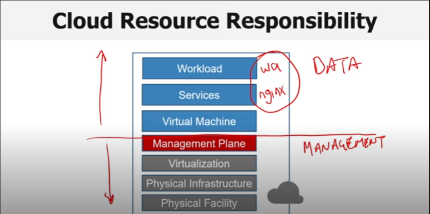

- Management Plan is the line blow which things work under the vender where as the above few things are under the user. So, if something happens in the respective area of the vender or the user then they are responsible for it.
- SLA (***Service Level Agreement***)

---
---

## 3. Cloud Services

### Cloud Infrastructure Services
---
It will cover the following few things.
- Infrastructure as a service
- Cloud Networking
- Cloud Compute
- Cloud Storage
---

- Infrastructure as a service is the lowest level of service provided by the Cloud Providers.
- They will be going to provide you all the services below the management plan.
- V-NET -- Virtual Network, VPC -- Virtual Private Cloud
- Boxes over lapping the main box lines are gateways

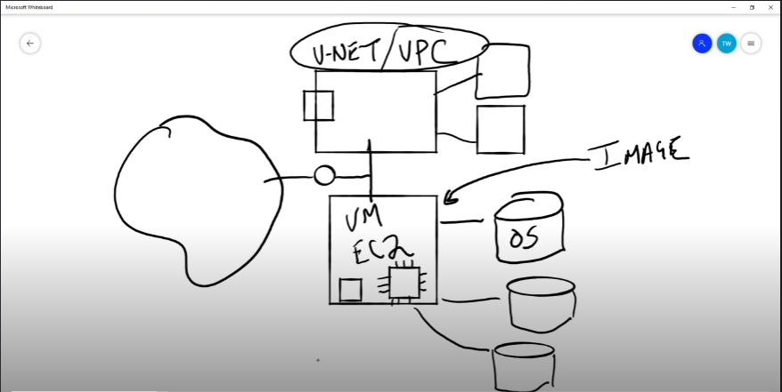

- NSG -- Network Security Group, ACL -- Access control list
- Big Box is the network, small boxes are the subnets.
- Gateway can be VPN Gateway, private circuit gateway
- LB -- Load Balancer
- FW -- Firewall 
- Following image is the example of Cloud Networking

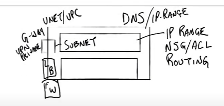

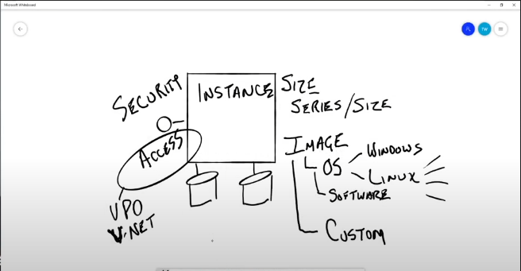

- For storage AWS has ***S3 Buckets***, ***EFS***, and ***EBS***.
- Azure has ***Storage Account*** and ***Management Disks***.
- GCP has ***Storage Bucket*** and ***Compute Engine Disks and Images***.
- ***EBS -- Elastic Block Storage*** is used for storing the disk for a EC2.

---

### Scalability and Availability:
---
It will cover the following few things.
- Regional Computing.
- Cloud Scale.
- Cloud Availability.
---

- In the context of regional cloud computing, a region refers to a geographical area where a cloud service provider, such as Amazon Web Services (AWS), Microsoft Azure, or Google Cloud Platform (GCP), has established data centers and infrastructure to offer its services.
- Scaling can be exampled as dividing the workload (one vm) on multiple other workloads (more than one vm).
- Being available when needed is known as Availability.
- Availability zones == Data Centers
- Now suppose that if your data centers fails you have other availability zones that your machine can use to run properly.

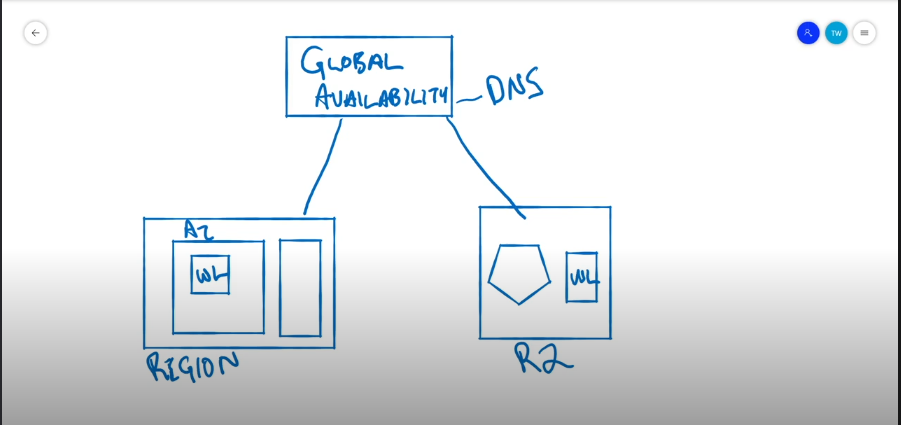

- If for any reason the region isn't working then the work load can be shifted to an other region.

---

### Cloud Platform Services
---
What will be covered in it.

- Platform as a service.
- Application Hosting.
- Data Hosting
- Other Services
---

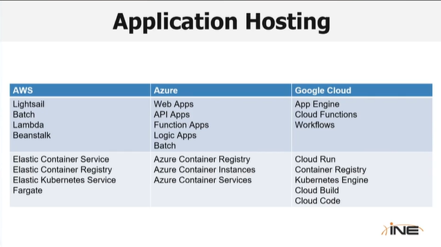

- ***Lambda*** in ***AWS***, ***Function Apps*** in ***AZURE***, and ***Cloud Function*** in ***GCP*** are all the same.
- The lower row is the container related Platform as a service.

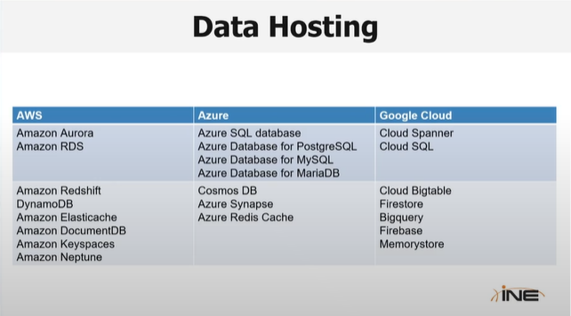

- In the above picture there are both ***relational*** and ***non-relational*** approaches.

---

### Cloud Application Services
---

What will be covered.

- Software as a service
- Salesforce
- Microsoft 365
- G Suite
- Collaboration
- Others
---

- You not building it you are buying it.
-  Microsoft 365 provides Low-Code and No-Code Customization.
- G Suite has similar offers has Microsoft 365.
- Collaboration Tools -- Slack, Zoom, Meet, Microsoft Team.

---
---

## 2. Cloud Management Concepts

### Cloud Shared Responsibility Model
---
It will cover the following few things.
- Shared responsibility model
- Management Responsibility
- Security Responsibility
- Resiliency Responsibility
- Work Load Responsibility 
---

- The cloud provider is always responsible for managing and securing facility, infrastructure, virtualization, and cloud management plane.
- You (user) on the other hand are always responsible for managing your identities, and access to your subscription.
- In infrastructure as a service we you (user) is responsible for managing virtual machines and above.
- In platform as a service you (user) is responsible for managing the workload only.
- In software as a service the provider is responsible for managing the full stack. You may be responsible for managing customizations. You are still responsible for managing customizations, usage, and adhering to good practices and compliance.

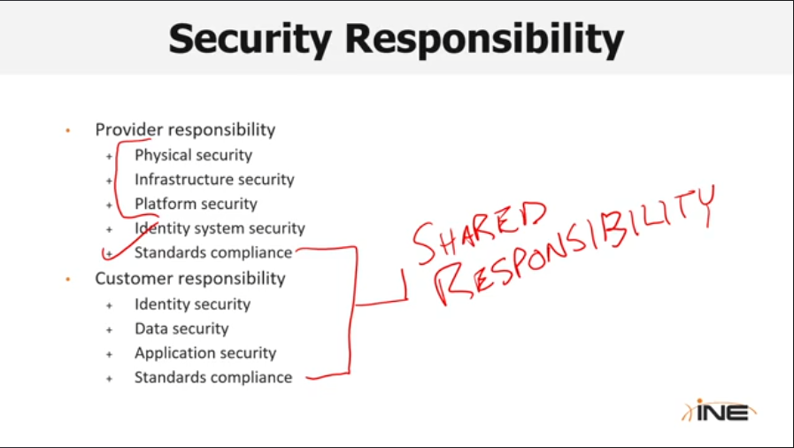

- ***Which of these is the responsibility of both the cloud provider and the customer?***
	- ***Standards compliance***
- ***Which of the following is not always the responsibility of the cloud provider?***
	- ***Virtual machine***
---

### Managing Cloud Assets 
---
It will cover the following few things.
- Provisioning Resources
- Configuring the resources
- Maintaining Resources
- Monitoring Resources
-  Change Management 
---

- You configure the resources the same way you provision them.
- In maintain resources you have to maintain ***Code Base***, ***Data***, and ***Security***.
- Governance is critical in the cloud.
-  Tools are available for maintaining change - platform specific and vendor natural.

- ***Which of the following are in the data plane for IaaS but not PaaS? (Choose two)***
	- ***Services***
	- ***Virtual Operating Systems***
- ***Which of the following is not a management tool provided by the cloud providers?***
	- ***Windows Application***

---

### Monitoring and Alerts 
---
It will cover the following few things.
- Cloud Monitoring
- Unified Monitoring
- Proactive Resource Management
---

- Cloud Monitoring has resource and system monitoring.
- All these give a framework to view everything. Like graphs and all.
- Unified Monitoring tools --> Nagios, Splunk, and PRTG.
- Proactive Resource Management has Cloud Automation and Cloud Alerting.
- Cloud Automation is made on the Cloud Alerting.

- ***CloudWatch is the monitoring tool for which cloud provider?***
	- ***AWS***

---

## Cloud Identity and Access Management
---
It will cover the following few things.
- Cloud-Based Identity
- Access Management 
---

- Under the root there are two major components i.e. ***Identity Component*** and ***Recourse Component***.
- Google --> Roles, AWS --> Policies (Group of permissions that can be assigned)
- A user account managed in another system, such as Active Directory, that is synchronized with the cloud provider is known as federated user.

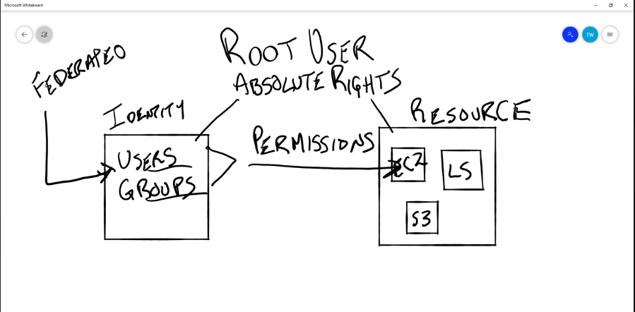

- Some what like on prem.

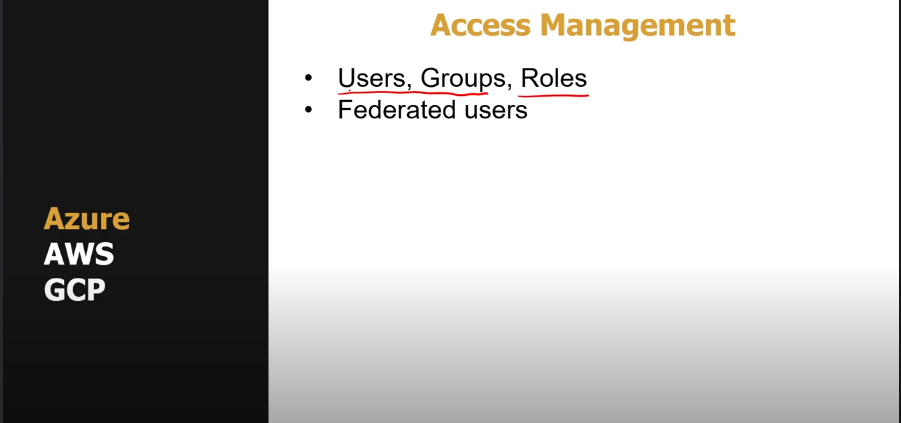

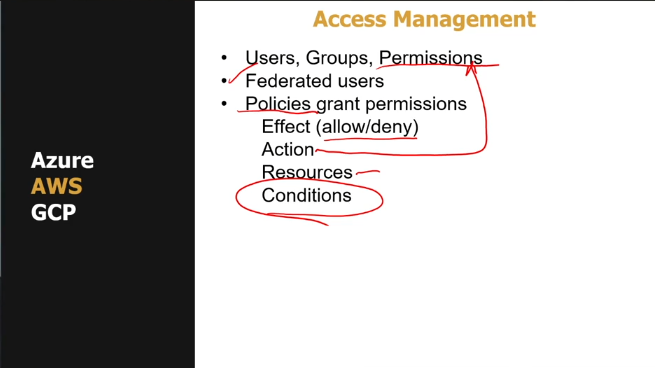

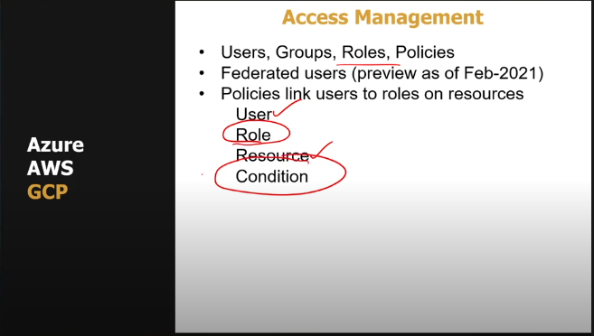

---
---

## Fundamentals of Cloud Identity, Security, and Compliance

### Fundamentals of the Cloud Security
---
It will cover the following things.

- Shared Responsibility Model
- Secure Cloud Resources
- Defense in depth.
---

- For the security point of view it depends on who is responsible for what.
- Under the Control Plane all the things are responsibility of the cloud provider.

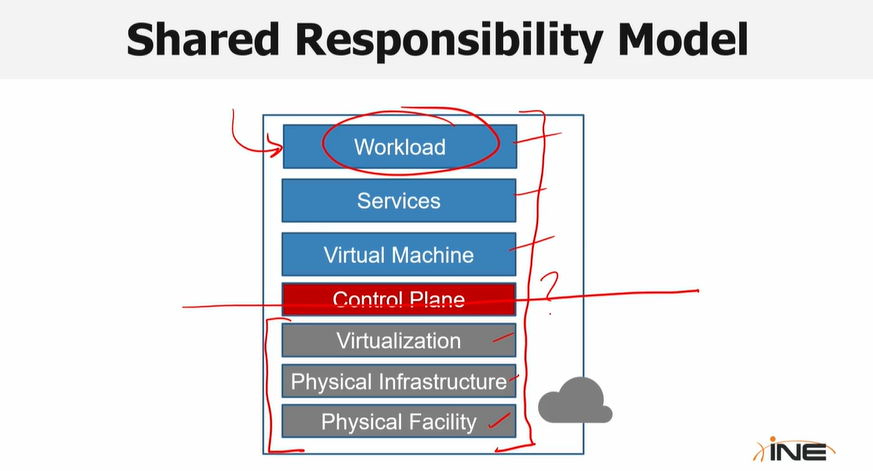

- In IaaS the user or the consumer is responsible for the above three.
- In PaaS the user only has to care about the workload.
- Control Plane will help me interact with the resources.
- Data inside the resources will be accessed according to the data plan.

 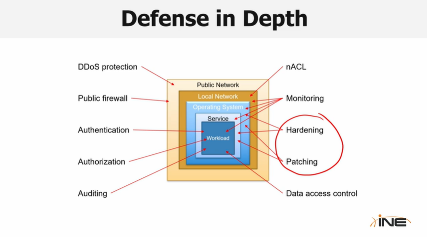

- Encryption at transit and Encryption at rest is the basic.
---

### Common Cloud Attacks
---
It will cover the following things.

- Attack Targets
- Attack Methods
---

- Attack targets are ***Identities***, ***Data***, and ***Services***.
- Attacks on Identity mostly happens two Software as a Service (SaaS) identities similarly it happens in Data Plane Identities as well.  
- Common attacks methods are ***misconfigurations***, ***account*** ***hijacking***, ***service*** ***hijacking***, and ***malwares***.  
---

### Identity and Access Management
---
It will cover the following things.

- Accessing and Managing Cloud Resources
- Managing Cloud Users
- Managing Access to Resources
---

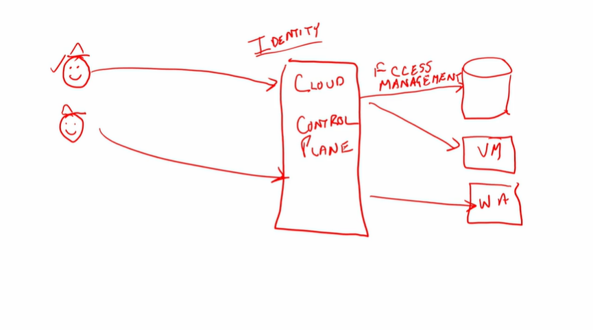

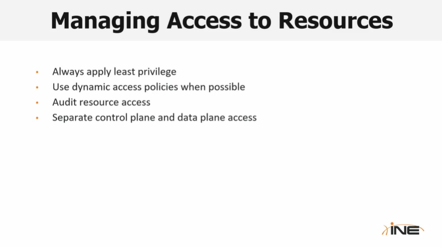

### Identity and Access Management
---
It will cover the following things.

- Accessing and Managing Cloud Resources
- Managing Cloud Users
- Managing Access to Resources
---

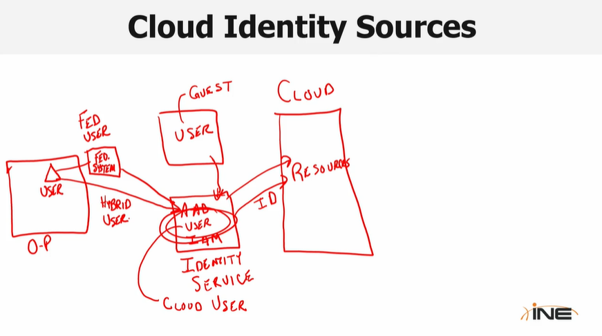

| Account Vulnerabilities     | Login Vulnerabilities             |
| --------------------------- | --------------------------------- |
| Weak Passwords              | IP Address and Location anomalies |
| Leaked Credentials          | Password spraying                 |
| General Threat Intelligence | Brute force attacks               |

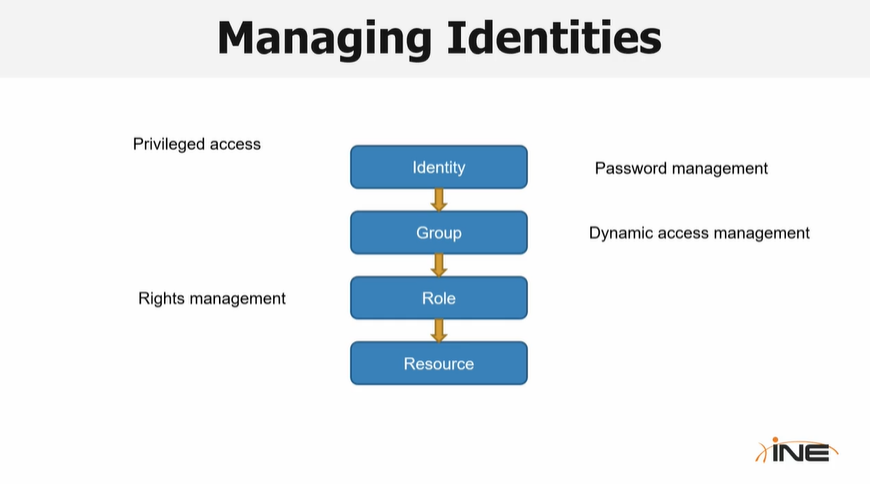

- Managing Identities 

| AWS          | AZURE                             | GCP             |
| ------------ | --------------------------------- | --------------- |
| IAM Users    | Azure AD Users                    | Google Account  |
| IAM Roles    | Azure AD Service Principle        | Service Account |
| IAM Polices  | Azure AD Managed Identities Roles | Roles           |
| ------------ | Roles                             | Policy          |

- Cloud Identity Protection Services

| AWS                | AZURE                | GCP                         |
| ------------------ | -------------------- | --------------------------- |
| Cloud Trials       | Identity Protection  | Advanced Protection Program |
| Trusted Advisors   | Azure AD Logs        | G-Suite alert center        |
| ------------------ | -------------------- | Titan Security Keys         |

---

### Responding to Identity Compromises
---
It will cover the following things.

- The Five R's
- The Response Process
---

**R1** -- `Revoke` -- Revoke the permissions -- Isolation 

**R2** -- `Reset` -- Sessions Tokens -- API Keys -- Resources access keys -- Try Rest

**R3** -- `Review` -- Review with IT and stake holders 

**R4** -- `Remediate` -- Fix it -- Reporting -- Lesson Learned

**R5** -- `Return` -- Return to operating state -- Monitor 

---

### Data Protection
---
It will cover the following things.

- Types of Cloud Data
- Protecting Data at Rest
- Protecting Data in Transit
- Connecting to Data
- Data Protection Best Practices
---

- Types of Cloud Data

| Files         | Relational  | Non-relational | Big Data          | Sensitive    |
| ------------- | ----------- | -------------- | ----------------- | ------------ |
| Blobs         | Managed     | Managed        | Semi - Structure  | Keys         |
| Buckets       | Proprietary | Proprietary    | ----------------- | Certificates |
| File Services | IaaS Hosted | IaaS Hosted    | ----------------- | Audit        |

- A relational database management system (RDBMS) organizes data into separate tables, allowing for flexible access and reassembly according to user-defined relational tables. In contrast, a non-relational database employs an architecture that does not rely on tables as its primary structure.

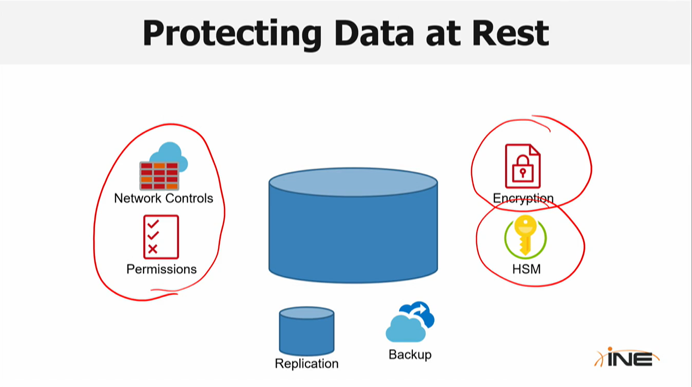

- Data Protection Bets Practices include ***Limiting Access***, ***Encryption***, ***Protection from failure***, and ***Auditing***.

***What sort of device do most cloud provider offer to securely store data such as encryption keys and certificates?***
- ***Hardware security modules (HSM)***

---

### Network Protection
---
It will cover the following things.

- Cloud Provider Network
- Tenant Network Protection
- Cloud Network Protection
- Network Protection Best Practices
---

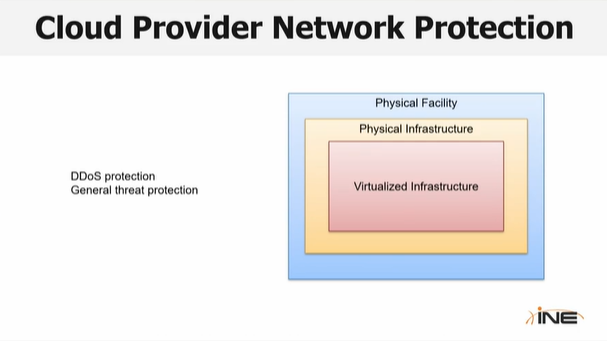

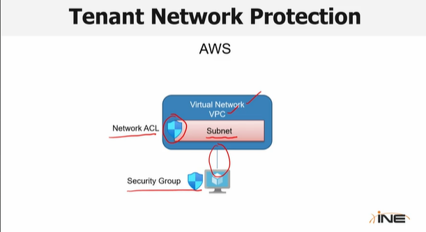

- In AZURE replace the ***Network ACL*** and ***Security Group*** with ***Network Security Group***.

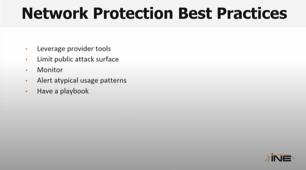

---

### Compute Protection
---
It will cover the following things.

- Infrastructure Compute Protection
- Platform Compute Protection
- Patching
- Confidential Compute
- Compute Monitoring
---

- Infrastructure Compute Protection includes ***Patch Management***, ***Resource Management***, ***Attack Surface Minimization***, ***Monitoring***, and ***OS Hardening***.  
- A lot of compute protection is actually about just using the platform.

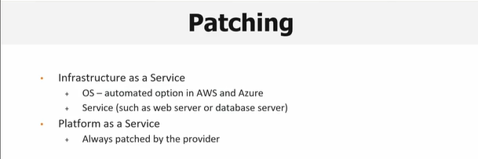

- Enclave is a digital wall around your actual compute. Can be done on both hardware and software level. 
- It saves the compute from unauthorized data access and code corruption.

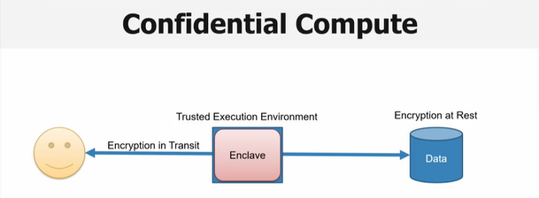

---

### Regulatory Compliance in the Cloud 
---
It will cover the following things.

- Cloud Provider Regulatory Support
- Tenant Responsibilities
- Common Protected Data 
---

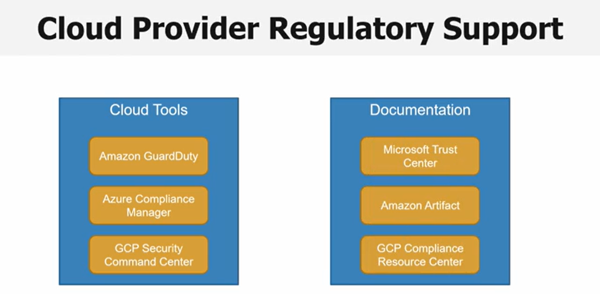

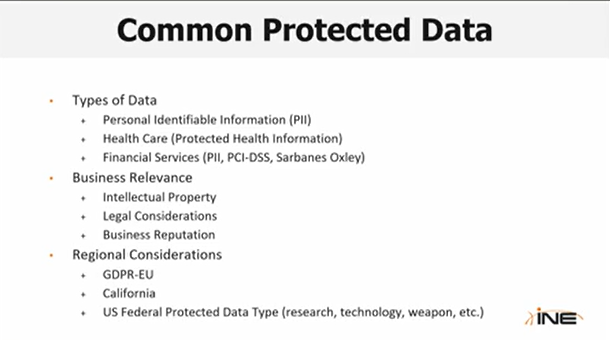

***Who is responsible for ensuring that a cloud provider's service offerings are compliant with your sensitive data workload?***
- ***The customer***
---
---
